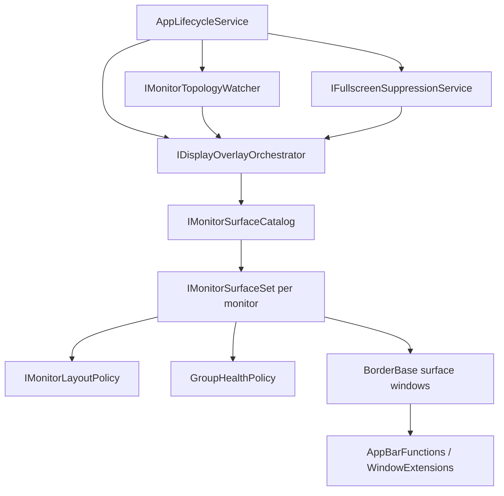

# NetBannerNG Architecture

This document defines the current runtime architecture and responsibility boundaries for monitor overlays.

## Runtime flow

1. `AppLifecycleService.InitializeRuntimeAsync()` wires runtime dependencies.
2. `IDisplayOverlayOrchestrator.Init()` initializes the overlay runtime.
3. `IDisplayOverlayOrchestrator.InitiateAllSurfaces()` reconciles monitor topology and shows per-monitor surfaces.
4. `IFullscreenSuppressionService` emits suppression updates.
5. `IDisplayOverlayOrchestrator.ApplyFullscreenSuppressionStates(...)` applies suppression state to monitor surface sets.
6. `IMonitorTopologyWatcher` triggers `IDisplayOverlayOrchestrator.Refresh()` on display topology changes.

## Core components and boundaries

### `IDisplayOverlayOrchestrator` / `DisplayOverlayOrchestratorRuntime`
- Coordinates lifecycle only: init, initiate, refresh, suppression apply, shutdown.
- Reads and applies suppression state but does not compute suppression.
- Uses catalog abstraction for monitor-set reconciliation.

### `IMonitorSurfaceCatalog` / `MonitorSurfaceCatalog`
- Owns monitor-id to monitor-set mapping.
- Reconciles add/update/remove based on monitor snapshots.
- Returns newly created monitor sets for orchestrator show sequencing.

### `IMonitorSurfaceSet` / `MonitorSurfaceSet`
- Owns all overlay windows for one monitor.
- Executes health-aware show/sync/close operations.
- Applies per-monitor topmost and bars visibility updates.
- Applies post-dock visual state for owned windows.

### `IMonitorLayoutPolicy` / `MonitorLayoutPolicyProvider`
- Central source of monitor-relative layout decisions.
- Used by monitor sets to apply monitor bounds and vertical geometry.

### `IFullscreenSuppressionService` / `FullscreenSuppressionService`
- Produces typed suppression payloads (`FullscreenSuppressionState`) keyed by group id.
- Suppression evaluation remains outside orchestrator logic.

### Watchers and adapters
- `IMonitorTopologyWatcher` abstraction decouples lifecycle/orchestrator logic from static watcher implementation.
- Static facades (`DisplayOverlayOrchestrator`, static watcher wrappers) are compatibility adapters over instance runtime components.

## Identity and grouping

- Group identity is generated by `IMonitorIdentity`.
- Identity is used by catalog reconciliation, suppression mapping, and cross-component coordination.

## Surface behavior contract

- Surface windows (`Banner`, `BottomBanner`, `BottomBar`, `LeftBar`, `RightBar`) remain responsible for render/dock internals.
- Monitor-level coordination (creation order, sync cadence, suppression application, close lifecycle) is handled by `MonitorSurfaceSet` and orchestrator/catalog layers.
